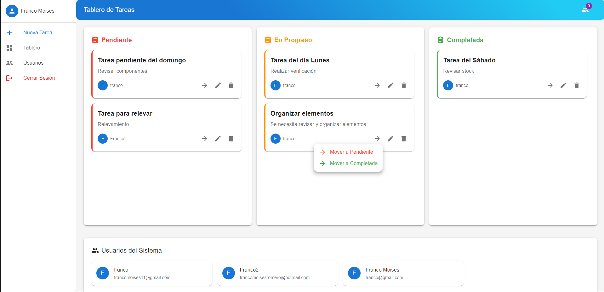
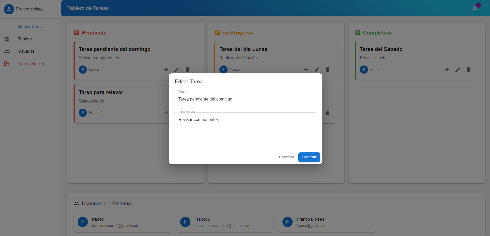
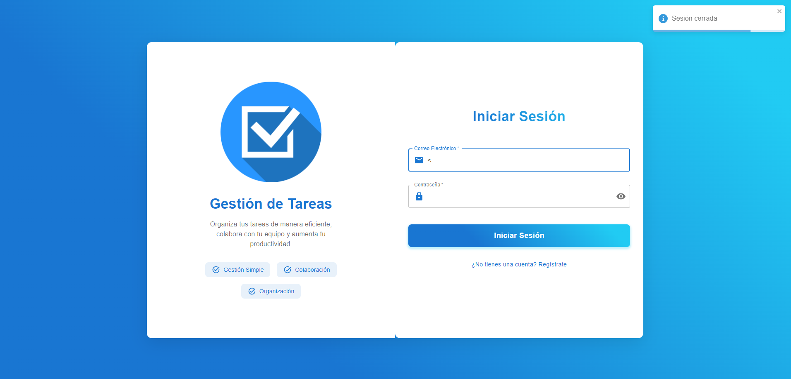
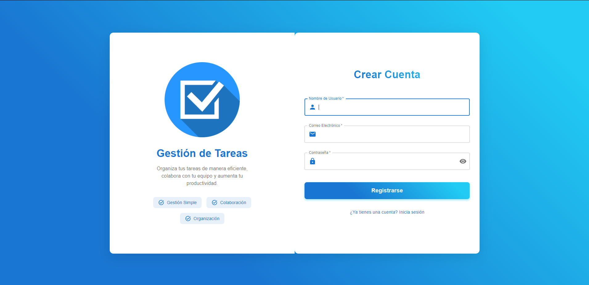

# FastAPI-React-Task-App
An example of login and dashboard for CRUD operations of tasks.

## Description
FastAPI-React-Task-App is a public project that demonstrates a login system and a dashboard for managing CRUD operations of tasks.

## Repository Structure
- **backend/**: Contains the FastAPI server, including the main application logic, routes, models, and dependencies.
  - `main.py`: Entry point of the FastAPI server.
  - `models.py`: Database models for the application.
  - `usuario_routes.py`: Routes related to user management.
  - `requirements.txt`: Python dependencies for the backend.

- **frontend/**: Contains the React-based frontend.
  - `src/components/`: Includes reusable React components.
    - `Login.jsx`: Login component.
    - `TaskBoard.jsx`: Dashboard to manage tasks.
    - `UserForm.jsx`: Form for adding/editing users.
    - `UserList.jsx`: List of users.

## How to Run the Project
### Backend
1. Navigate to the `backend` directory:
```bash
   cd backend
```
2. Create and activate a virtual environment:
```bash
  python -m venv venv
  source venv/bin/activate  # On Windows, use venv\\Scripts\\activate
```
3. Install dependencies:
```bash
  pip install -r requirements.txt
```
4. Run the FastAPI server:
```bash
  uvicorn main:app --reload
```
### Frontend
1. Navigate to the frontend directory:
```bash
  cd frontend
```
2. Install dependencies:
```bash
  npm install
```
3. Start the development server:
```bash
  npm run dev
```

## Images 📸



 
